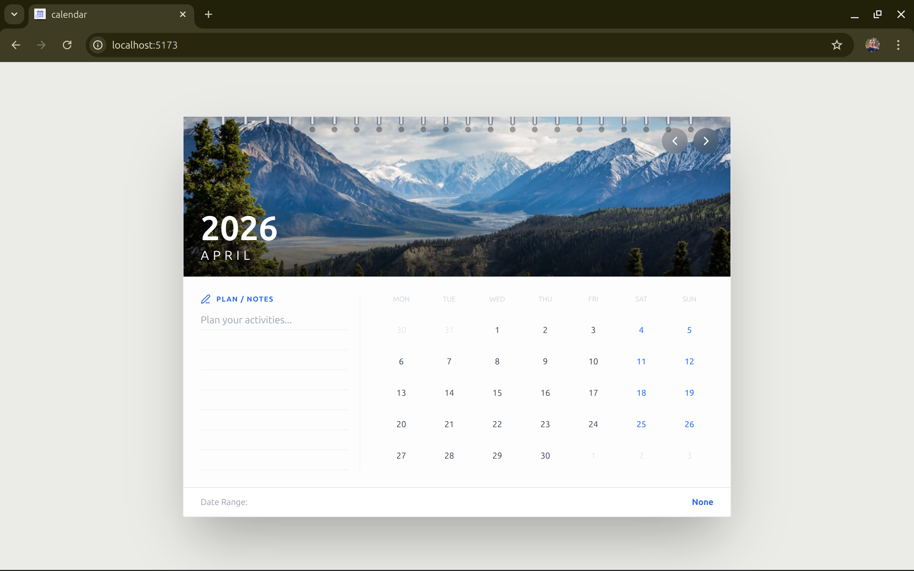
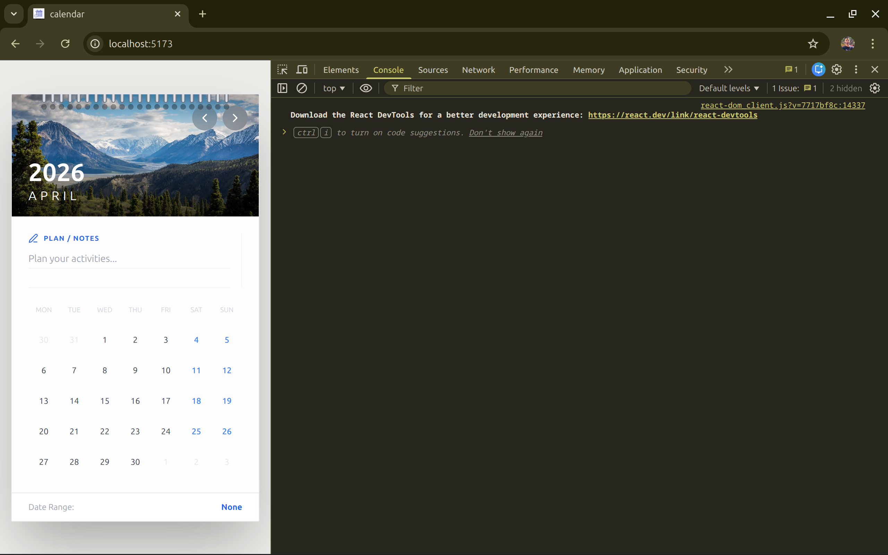
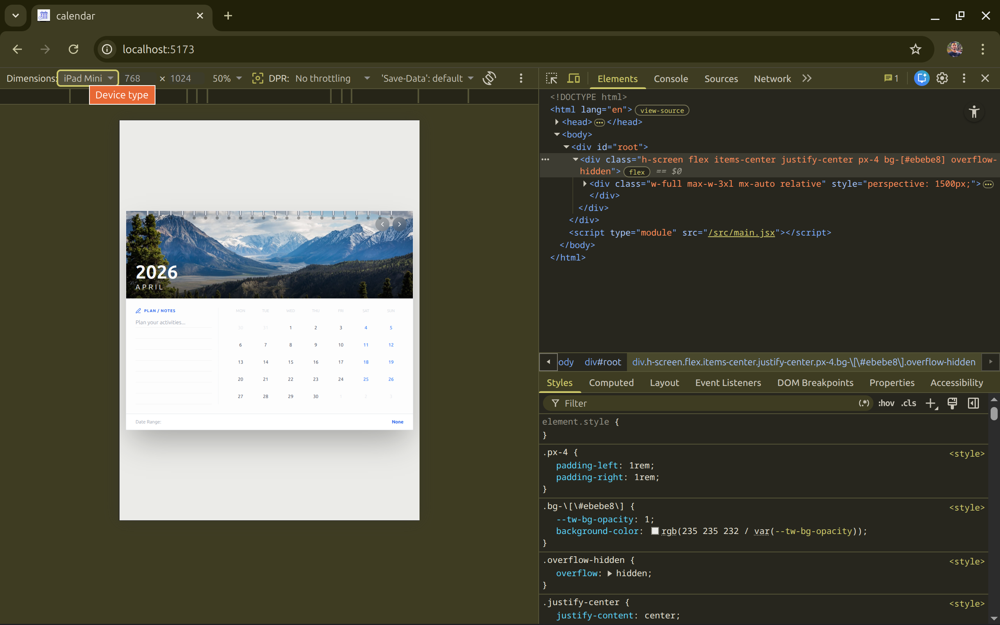
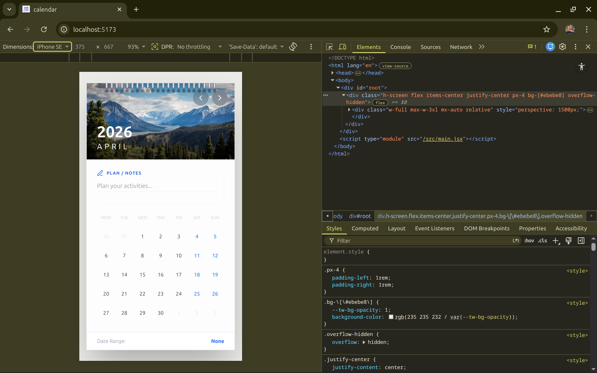

# 📅 Interactive Wall Calendar Component
A modern, interactive wall calendar built using React, inspired by real-world physical calendars. This project focuses on clean UI, smooth animations, and responsive design.

---

## 📸 Screenshot

---

## ✨ Features

- 📆 **Wall Calendar UI**
  - Realistic layout with hero image and spiral binding
  - Clean and minimal design

- 📅 **Date Range Selection**
  - Select start and end dates
  - Highlighted range with clear visual feedback

- 📝 **Notes Section**
  - Write monthly plans and reminders
  - Notebook-style lined UI

- 🎞 **Smooth Animations**
  - Page flip animation when switching months

- 📱 **Responsive Design**
  - Desktop: Notes + Calendar side-by-side  
  - Mobile: Fully stacked layout

- 🎨 **UI/UX Focus**
  - No-scroll layout (fits screen)
  - Weekend highlighting
  - Clean spacing and typography

---

## 🛠 Tech Stack

- React (Vite)
- Tailwind CSS
- Framer Motion
- date-fns
- Lucide Icons

---

## 📁 Project Structure
src/
├── components/
│ ├── Calendar.jsx
│ ├── Hero.jsx
│ ├── Notes.jsx
│ ├── Footer.jsx
├── main.jsx
├── index.css

---

## 🌐 Live Demo

https://interactive-wall-calendar-beryl.vercel.app/

--- 

## 🚀 How to Run Locally

1. Clone the repository
git clone https://github.com/VersaTechDev/interactive-calendar.git
2. Navigate to project
3. Install dependencies
4. Run the project 
5. Open in browser - http://localhost:5173

---

## 💡 Design Decisions

- Used component-based architecture for better maintainability
- Focused on realistic UI (wall calendar aesthetic)
- Implemented smooth animations using Framer Motion
- Designed layout to avoid scrolling for better UX
- Kept project frontend-only as per requirements

---

## 🎯 Scope

This is a frontend-only project:
- No backend
- No database
- Uses local state only

---

## 🙌 Author

**Vikrant Kumar**

---

## 🚀 Future Improvements

- Save notes using localStorage
- Theme customization
- Notes per date range

---

